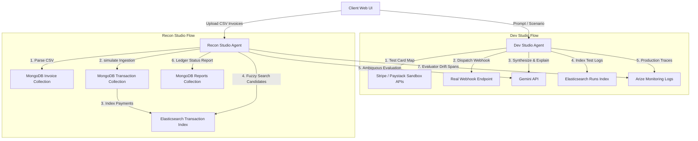

# PayLens

PayLens is an intelligent financial operations platform featuring two specialized AI agents designed to solve common payment integration testing and ledger bookkeeping challenges.

## Live Demo Links

- **Frontend Application (Vercel)**: [https://pay-lens-jet.vercel.app](https://pay-lens-jet.vercel.app)
- **Backend API (Railway)**: [https://paylens.railway.app](https://paylens.railway.app)

## System Architecture



---

## The Step-By-Step Flows

### Agent 1: Dev Studio (Payment Sandbox Agent)

1. **Input**: The developer inputs their Stripe or Paystack test account API secret key, their target webhook endpoint URL, and a test scenario in plain English (e.g. "Simulate a payment failure due to insufficient funds").
2. **Token Mapping**: The agent reads the scenario and automatically picks the appropriate card token or credentials required by the sandbox to trigger that specific error.
3. **Simulation Execution**: The agent triggers a real API charge call against the Stripe or Paystack sandbox environment.
4. **Webhook Dispatching**: The agent captures the charge response, wraps it inside a provider-shaped webhook event body (Stripe JSON object or Paystack JSON object), fires it to the developer's real server URL, and measures the response time.
5. **AI Reasoning**: Gemini reads the sandbox payment response, the webhook HTTP status, and the developer's receiver server response body, explaining what went right or wrong in plain language.
6. **Log Indexing & Tracing**: The run details are indexed in Elasticsearch for logs search, and the execution span is tracked by the Arize monitor to inspect model accuracy and latency.

### Agent 2: Recon Studio (Payment Reconciliation Agent)

1. **Ingestion**: The business uploads a CSV file containing outstanding invoices. The agent parses the entries and saves them to MongoDB under the unpaid status.
2. **Transaction Syncing**: Triggering a sync simulates Fivetran ingestion, creating transactional data from Stripe, Paystack, and bank statements with variations (such as name typos, amount differences due to transaction fees, and unmatched items).
3. **Fuzzy Search Query**: Elasticsearch indexes the transactions and runs fuzzy queries on customer names and amount tolerances (accounting for payment gateway deductions) to find potential matches.
4. **Gemini Matching Suggestion**: For exact matches, the status is set directly. For ambiguous or fee-deducted candidates, Gemini evaluates the candidate, suggests a match decision with a confidence score, and describes its logic.
5. **Human Audit Action**: The user reviews the recommendations, approving or rejecting them. Approvals mark the invoice as paid in MongoDB and remove the payment from the Elasticsearch index.
6. **Reporting**: The system compiles a ledger balancing snapshot, calculating total volume, outstanding balance, and drift metrics.

---

## Tech Stack & Integrations

- **Gemini**: The model (gemini-2.0-flash) powers payment result explanations and fuzzy matching evaluations.
- **Elasticsearch**: Handles full-text logs search in Dev Studio and fuzzy-phrase candidate indexing for Recon Studio.
- **MongoDB**: Serves as the primary transaction, invoice, match, and reports document store.
- **Arize**: Tracks agent trace spans, latency, and matching accuracy metrics to monitor performance drift in production.
- **Stripe & Paystack Sandbox APIs**: The payment gateways tested by the Dev Studio agent.

---

## Getting Started

### Prerequisites
- Node.js (v18+)
- MongoDB running instance
- Elasticsearch running instance

### Environment Variables

Create a `.env` file in the `backend` directory:
```env
PORT=3001
MONGODB_URI=mongodb://localhost:27017/paylens
JWT_SECRET=your_jwt_secret_token_here

GEMINI_API_KEY=your_gemini_api_key_here
GEMINI_MODEL=gemini-2.0-flash

ELASTIC_URL=http://localhost:9200
ELASTIC_API_KEY=your_elastic_api_key_optional
```

Create a `.env.local` file in the `frontend` directory:
```env
# For local development:
NEXT_PUBLIC_API_URL=http://localhost:3001

# For live/production site:
NEXT_PUBLIC_API_URL=https://paylens.railway.app
```

### Installation

Install dependencies in both directories:

In backend:
```bash
npm install
```

In frontend:
```bash
npm install
```

### Running the App

Start Backend Server:
```bash
cd backend
npm run start:dev
```
The backend server runs on http://localhost:3001.

Start Frontend Dev Server:
```bash
cd frontend
npm run dev
```

Open http://localhost:3000 in your web browser.

---

## Authentication and Guest Access

You can test the application in two ways:
1. **Standard JWT Accounts**: Register a secure account on the Register page. Credentials are encrypted using bcryptjs.
2. **Continue as Guest**: Skip registration entirely by clicking "Continue as Guest" on the Login screen. The app falls back to a guest session using an anonymous database scope, letting judges run live tests immediately without signup.
